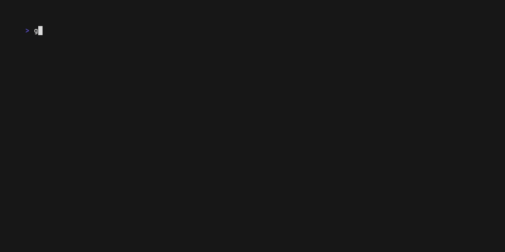

# Weather

A weather application made on top of the weather.gov and Nominatim/OpenStreetMap
APIs, written in Go (v1.22.4)


---



---

The demo video is generated using `vhs`. See [demo.tape](assets/demo.tape) or [interactive.tape](assets/interactive.tape) for
the exact commands seen above. For the extended video, see [here](assets/extended.webm).

## Usage

- `geocast` or `geocast me` to get the weather forecast for the current IP address.
- `geocast [city]` to get the weather forecast for a city.
- `geocast [lat,lon]` to get the weather forecast for a latitude and longitude.
- `geocast --interactive` to get the weather forecast for the current IP address in an interactive mode.

---

- `geocast geocode` or `geocast g` to geocode a city.
- `geocast geocode [city]` to geocode a city.
- `geocast geocode [lat,lon]` to reverse geocode a latitude and longitude.
- `geocast geocode --interactive` to geocode a city in an interactive mode.

---

- `geocast forecast` or `geocast f` to get the weather forecast for the current IP address.
- `geocast forecast [city]` to get the weather forecast for a city.
- `geocast forecast [lat,lon]` to get the weather forecast for a latitude and longitude.
- `geocast forecast --interactive` to get the weather forecast for the current IP address in an interactive mode.

## Data Sources

1. Geocoding

   - ipinfo
   - Nominatim/OpenStreetMap (osm)

2. Weather
   - weather.gov (US)

### Sample US Data

| City        | State | Latitude | Longitude |
| ----------- | ----- | -------- | --------- |
| Seattle     | WA    | 47.6062  | -122.3321 |
| Austin      | TX    | 30.2672  | -97.7431  |
| Cleveland   | OH    | 41.4993  | -81.6944  |
| Hartford    | CT    | 41.7658  | -72.6734  |
| Boston      | MA    | 42.3601  | -71.0589  |
| Los Angeles | CA    | 34.0522  | -118.2437 |
| Pittsburgh  | PA    | 40.4406  | -79.9959  |

## Updating Test Coverage

This project leverages a few tools executed by `coverage.py` to generate the
below coverage image, namely playwright and the built-in `go tool cover` command.

To ensure that you're able to generate the coverage image, you'll need to install
the `playwright` package and install the `chromium` browser.

Setup the virtual environment and install the dependencies:

```bash
virtualenv .venv
source .venv/bin/activate
pip install -r requirements.txt
```

Then, install `playwright` with firefox and chromium:

```bash
playwright install
```
